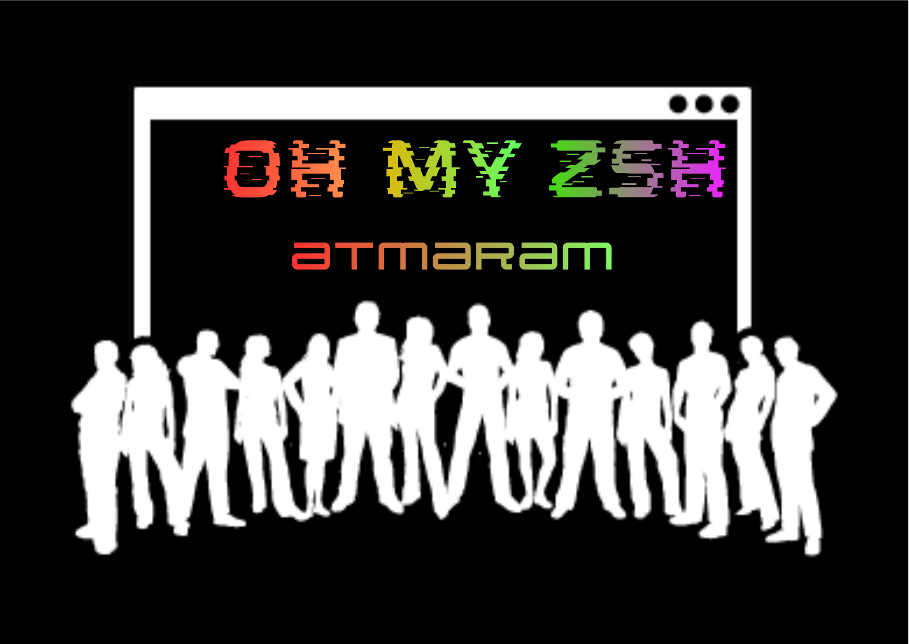
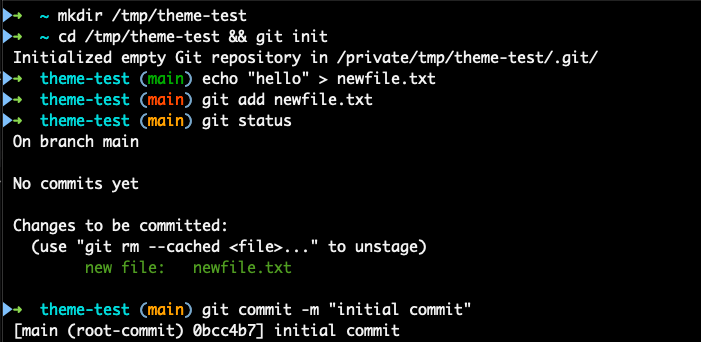

# atmaram.zsh-theme

A minimal [oh-my-zsh](https://ohmyz.sh) theme inspired by [robbyrussell](https://github.com/ohmyzsh/ohmyzsh/blob/master/themes/robbyrussell.zsh-theme) — same clean layout, but with **git status color coding** so you know your workflow state at a glance.

<p align="center">
  
</p>

<h1 align="center">
  
</h1>

## Why

robbyrussell is the best minimal theme — clean, fast, no clutter. But its git indicator is binary: a `✗` that means "something changed." It tells you nothing about *what kind* of change.

This theme keeps everything you love about robbyrussell and adds one insight: **the branch name itself changes color** based on what's actually going on in your working tree.

---

## Prerequisites

- [Zsh](https://www.zsh.org) ≥ 5.0
- [oh-my-zsh](https://ohmyz.sh)

---

## Prompt layout

```
➜  dirname (branch-name)
```

- `➜` — green on success, red if the last command failed
- `dirname` — current directory only (not full path), in cyan
- `(branch-name)` — git branch in colored bold, inside blue parens

---

## Git status colors

| State | Branch color | What it means |
|-------|:-----------:|---------------|
| Clean working tree | **Green** | Nothing to commit |
| Staged changes only | **Amber** | Changes staged — ready to `git commit` |
| Unstaged or untracked | **Red** | Work in progress — needs `git add` |
| Mixed (staged + unstaged) | **Red** | Unstaged takes priority |

---

## Additional indicators

Shown inside the branch parentheses when relevant:

| Indicator | Color | Meaning |
|-----------|:-----:|---------|
| `↑N` | Cyan | N commits ahead of remote |
| `↓N` | Cyan | N commits behind remote |
| `⚑` | Magenta | Stashed changes exist |

Example prompt states:

```
# Clean, synced with remote
➜  myproject (main)                  ← green branch

# Staged changes — ready to commit
➜  myproject (main)                  ← amber branch

# Unstaged edits, 2 commits ahead, stash exists
➜  myproject (main ↑2 ⚑)            ← red branch

# Behind remote
➜  myproject (main ↓3)               ← green branch

# Detached HEAD
➜  myproject (HEAD:abc1234)

# Outside a git repo
➜  myproject
```

---

## Installation

### oh-my-zsh

```sh
# 1. Clone into your oh-my-zsh custom themes directory
git clone https://github.com/YOUR_USERNAME/atmaram-zsh-theme.git \
  "${ZSH_CUSTOM:-$HOME/.oh-my-zsh/custom}/themes/atmaram-zsh-theme"

# 2. Symlink the theme file
ln -s "${ZSH_CUSTOM:-$HOME/.oh-my-zsh/custom}/themes/atmaram-zsh-theme/atmaram.zsh-theme" \
      "${ZSH_CUSTOM:-$HOME/.oh-my-zsh/custom}/themes/atmaram.zsh-theme"
```

3. Open `~/.zshrc` and set:
   ```sh
   ZSH_THEME="atmaram"
   ```

4. Reload:
   ```sh
   source ~/.zshrc
   ```

### Manual (single file copy)

```sh
cp atmaram.zsh-theme "${ZSH_CUSTOM:-$HOME/.oh-my-zsh/custom}/themes/"
```

Then set `ZSH_THEME="atmaram"` in `~/.zshrc` and run `source ~/.zshrc`.

---

## Customization

Set any of these in `~/.zshrc` **before** the `source $ZSH/oh-my-zsh.sh` line:

```sh
# Change the prompt arrow  (default: ➜)
ATMARAM_PROMPT_CHAR="❯"

# Git branch colors — 256-color spectrum codes (000–255)
# Run  spectrum_ls  in your terminal to browse all 256 colors.
ATMARAM_GIT_COLOR_CLEAN="034"       # clean working tree  (default: 034  green)
ATMARAM_GIT_COLOR_STAGED="214"      # staged only         (default: 214  amber)
ATMARAM_GIT_COLOR_UNSTAGED="196"    # unstaged/untracked  (default: 196  red)
```

### Picking colors with `spectrum_ls`

With oh-my-zsh loaded, run `spectrum_ls` to preview all 256 colors with their codes. Some useful picks:

| Code | Description |
|:----:|-------------|
| `034` | Medium green (default clean) |
| `046` | Bright green |
| `214` | Amber / orange (default staged) |
| `226` | Bright yellow |
| `196` | Pure red (default unstaged) |
| `202` | Orange-red / tomato |
| `160` | Dark red / crimson |

---

## Comparison with robbyrussell

| Feature | robbyrussell | atmaram |
|---------|:-----------:|:-------:|
| Minimal layout | ✓ | ✓ |
| Current dir only | ✓ | ✓ |
| Exit code arrow color | ✓ | ✓ |
| Git branch name | ✓ | ✓ |
| Dirty indicator | `✗` symbol | Branch color |
| Staged vs unstaged distinction | ✗ | ✓ |
| Ahead / behind remote | ✗ | ✓ |
| Stash indicator | ✗ | ✓ |
| Detached HEAD | ✗ | ✓ |
| Configurable arrow | ✗ | ✓ |
| 256-color support | ✗ | ✓ |

---

## Contributing

Bug reports and suggestions are welcome — open an issue or submit a pull request.

If you find a terminal or oh-my-zsh setup where the theme breaks, please include your
`zsh --version`, oh-my-zsh version, and terminal emulator when reporting.

---

## Acknowledgements

- [robbyrussell](https://github.com/ohmyzsh/ohmyzsh/blob/master/themes/robbyrussell.zsh-theme) — the original minimal theme this is based on
- [oh-my-zsh](https://github.com/ohmyzsh/ohmyzsh) — for `spectrum.zsh`, `git.zsh` helpers, and the theme framework
- [bureau.zsh-theme](https://github.com/ohmyzsh/ohmyzsh/blob/master/themes/bureau.zsh-theme) — for the staged/unstaged porcelain parsing pattern

---

## License

MIT — see [LICENSE](LICENSE).
